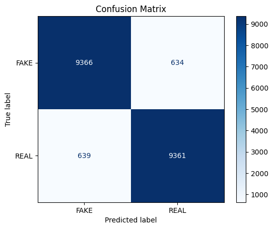
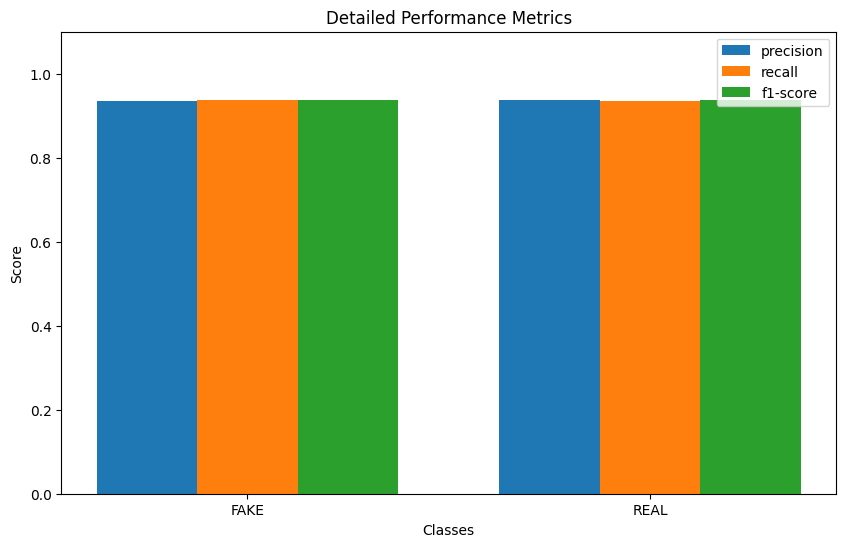
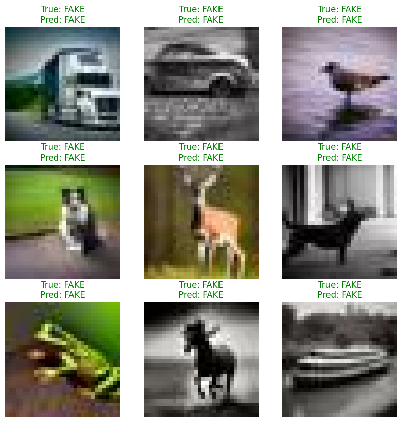

# VERITAS - AI Image Forensics

**Live Site:** [Hugging Face Space](https://huggingface.co/spaces/Avanith1/veritas-ai-detector) 

##  V2 Upgrade: Dual-Model Forensics
VERITAS has been upgraded to a dual-model system, allowing for cross-verification of AI-generated content.

### V1 (Fast/Low-Res)
- **Resolution:** 32x32 pixels
- **Model:** Custom CNN
- **Best For:** Speed and legacy AI artifacts.

### V2 (Accurate/High-Res)
- **Resolution:** 224x224 pixels
- **Model:** EfficientNetB0 (Transfer Learning)
- **Best For:** Modern high-fidelity AI generators (Midjourney, DALL-E 3).

The app is currently hosted on **Hugging Face Spaces** with free persistent hosting and optional GPU acceleration.

---

## Two Versions Available

This repository contains **two implementations** of VERITAS:

### 1. Gradio Version (Recommended)
- **File:** `app.py`
- **UI:** Cyberpunk terminal theme with green monospace text
- **Deployment:** Hugging Face Spaces
- **Status:**  **Currently Live**
- **Pros:** Simple interface, free hosting, optional GPU
- **Run locally:** `python app.py` (requires `gradio`)

### 2. Flask Version (Original)
- **File:** `web_app/app.py`
- **UI:** Full cyberpunk interface with Evidence Locker
- **Deployment:** Local or Render.com
- **Status:** Available for local use
- **Pros:** Rich UI, drag-and-drop from Evidence Locker
- **Run locally:** `cd web_app && python app.py`

**Both versions use the same model** (`web_app/ai_detector_model.h5`) and prediction logic (`web_app/model_handler.py`).

---

## Model Details

- **Architecture:** CNN with 3 convolutional layers
- **Training Data:** 60,000 images from CIFAKE dataset (30K real, 30K AI-generated)
- **Input Resolution:** 32x32 RGB
- **Validation Accuracy:** ~93%
- **Model Size:** 1.9 MB

---

## How It Works

1. Upload an image or select an example
2. The model preprocesses the image (resize to 32x32, normalize)
3. CNN analyzes patterns to detect AI artifacts
4. Returns verdict: REAL or FAKE with confidence score

---

## Limitations

This model is trained on **low-resolution (32x32) images**. High-quality AI art from modern generators (Midjourney v6, DALL-E 3, Stable Diffusion) may be misclassified due to resolution downscaling.

**Best results:** Images similar to the CIFAKE training distribution.

---

## Deployment Options

### Option 1: Hugging Face Spaces (Current)
- **URL:** [https://huggingface.co/spaces/Avanith1/veritas-ai-detector](https://huggingface.co/spaces/Avanith1/veritas-ai-detector)
- **Pros:** Free, persistent, optional GPU, designed for ML apps
- **Cons:** Simpler UI (Gradio)
- **Status:**  Live and working

### Option 2: Render.com (Not Recommended)
- **Status:** Attempted but not currently deployed
- **Issues:**
  - Free tier has only 512 MB RAM (model + TensorFlow exceeds this)
  - Frequent worker timeouts and crashes
  - 15-minute sleep timeout
  - Slow CPU causes prediction delays
- **Verdict:** Use HF Spaces instead for ML/AI applications

### Option 3: Local Development
```bash
# Flask version (original UI)
cd web_app
python app.py
# Access at http://localhost:5000

# Gradio version (HF Spaces UI)
python app.py
# Access at http://localhost:7860
```

---

## Repository Structure

```
veritas-ai-detector/
├── app.py                          # Gradio interface (HF Spaces)
├── requirements.txt                # HF Spaces dependencies
├── README.md                       # This file
├── Procfile                        # Render.com config (not used)
│
└── web_app/                        # Shared resources
    ├── model_handler.py            # AI prediction logic
    ├── ai_detector_model.h5        # Trained CNN model
    ├── app.py                      # Flask application
    ├── templates/                  # Flask HTML templates
    ├── static/                     # Flask CSS/JS assets
    └── test_examples/              # 10 sample images (5 real, 5 fake)
```

---

## Local Setup

### Requirements
- Python 3.8+
- TensorFlow 2.15+
- Flask (for web_app version)
- Gradio 4.0+ (for HF Spaces version)

### Installation
```bash
git clone https://github.com/Avanith12/veritas-ai-detector.git
cd veritas-ai-detector

# For Flask version
cd web_app
pip install -r ../requirements.txt
python app.py

# For Gradio version
pip install gradio
python app.py
```

---

## Performance

- **Accuracy:** ~93% on validation set
- **Prediction Time:** 
  - Local: <1 second
  - HF Spaces (CPU): 1-2 seconds
  - HF Spaces (GPU): ~0.2 seconds
- **Memory Usage:** ~100-200 MB

### Detailed Metrics

#### Confusion Matrix


#### Performance Metrics


#### Sample Predictions


---

## Credits

- **Dataset:** [CIFAKE](https://www.kaggle.com/datasets/birdy654/cifake-real-and-ai-generated-synthetic-images) (60,000 images)
- **Author:** Avanith Kanamarlapudi
- **Framework:** TensorFlow/Keras, Flask, Gradio
- **Deployment:** Hugging Face Spaces

---

## License

MIT License - feel free to use for educational and research purposes.

---

**Built by Avanith Kanamarlapudi**
